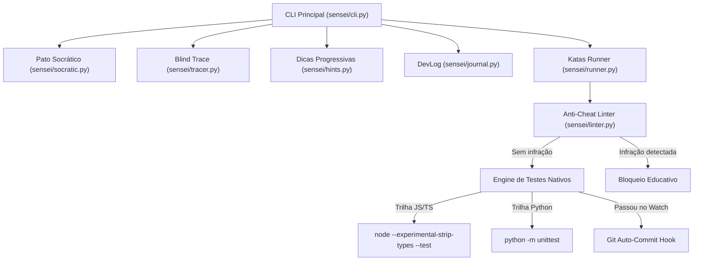

# 🏗️ Arquitetura e Engenharia Interna do Code Sensei

O **Code Sensei** foi projetado seguindo princípios de **Zero-External-Dependencies** para a suíte de execução, garantindo inicialização em milissegundos e máxima portabilidade no Windows e Linux.

---

## Diagrama de Componentes

---

## Detalhamento dos Módulos

### 1. `sensei/runner.py` (O Motor de Testes)
- **Descoberta:** Lê o arquivo `.sensei_config.json` para saber a trilha ativa (`js_ts` ou `python`).
- **Execução Nativa em TypeScript:** Usa o recurso mais moderno do Node.js 24 (`--experimental-strip-types`), removendo a tipagem TS em tempo de execução sem precisar de `tsc`, `ts-node` ou `node_modules` pesados.
- **Filtro de Output:** Intercepta as saídas do runner nativo e extrai cirurgicamente apenas as linhas de asserção quebradas e a documentação oficial.
- **Git Auto-Commit:** Monitora o conjunto de exercícios que estavam falhando. Quando um exercício transiciona de `FAIL` para `PASS`, dispara `git add` e `git commit -m "feat(kata): resolve nivel XX"`.

### 2. `sensei/linter.py` (Anti-Cheat Linter)
- Realiza análise estática via regex/AST no código antes de submetê-lo ao compilador.
- Remove comentários para evitar falsos positivos.
- Bloqueia métodos mágicos quando o objetivo do kata é exercitar a lógica manual (ex: `Math.max` no Nível 04).

### 3. `sensei/hints.py` (Motor de Dicas Progressivas)
- Estruturado em 3 camadas de abstração cognitiva:
  - **Nível 1 (Socrática):** Pergunta que induz à reflexão conceitual.
  - **Nível 2 (Estrutura):** Passo a passo em pseudocódigo.
  - **Nível 3 (Doc API):** Nomes exatos de métodos e assinaturas da biblioteca padrão.

### 4. `sensei/tracer.py` (Compilador Mental)
- Banco de desafios de avaliação mental de código.
- Compara a resposta digitada pelo usuário com a saída exata do runtime e explica o modelo de memória subjacente (Escopo léxico, mutação por referência, fila de Microtasks).

### 5. `sensei/journal.py` (DevLog Metacognitivo)
- Gerencia o diretório `devlog/` gravando arquivos Markdown datados com o template de análise de causa raiz e discrepância de modelo mental.

---

## 🔗 Navegação
- Conheça os níveis em [[Mapa-de-Niveis]].
- Aprenda como estudar sem IA em [[Como-Estudar-Sem-IA]].
- Voltar ao início: [[INDEX]].
