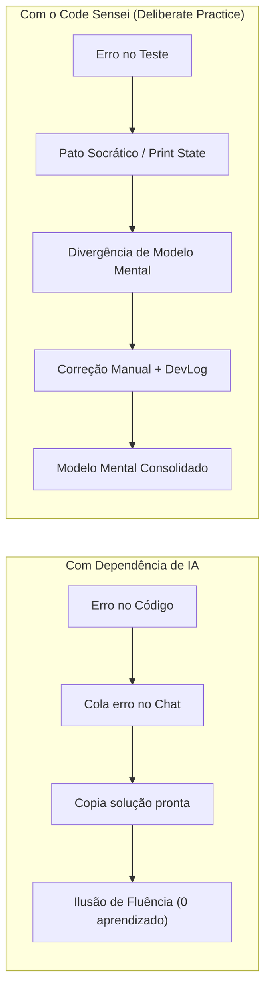

# 🧠 Como Estudar e Aprender Programação Sem Depender de IA

## O Problema: A Ilusão de Fluência (Fluency Illusion)

Quando você usa ferramentas gerativas (ChatGPT, Copilot, autocompletion) enquanto ainda está aprendendo as bases:
1. Você lê um bloco de código pronto gerado em 2 segundos.
2. Seu cérebro reconhece a lógica e tem a sensação reconfortante de que *"entendeu"*.
3. No dia seguinte, diante de uma tela em branco sem IA, você **não consegue escrever 5 linhas funcionais**.

> [!danger] O Diagnóstico
> **Reconhecer código não é o mesmo que ser capaz de sintetizá-lo.**
> O cérebro só constrói conexões neurais duradouras quando enfrenta a **Luta Produtiva** (*Productive Struggle*): a tensão cognitiva de tentar, errar, inspecionar estado e formular uma hipótese própria.

---

## Os 4 Pilares do Aprendizado Autônomo

### 1. Construir a "Notional Machine" (Máquina Mental)
Todo programador proficiente possui na cabeça um simulador do runtime da linguagem.
- O que acontece na memória quando declaro `let x = [1, 2]`?
- Para onde aponta a pilha de chamadas (*Call Stack*)?
- Onde a Promise espera antes de ser executada pelo Event Loop?
Se você terceiriza isso para a IA, sua máquina mental nunca é construída. Pratique com o modo [[#Blind Trace]]: `python main.py trace`.

### 2. Prática Deliberada via TDD (Test-Driven Development)
Em vez de tutoriais passivos de vídeo (onde você digita copiando o professor):
- Você recebe um contrato de teste unitário estrito.
- O teste falha.
- Você consulta a **documentação oficial da linguagem** (MDN, Node docs).
- Você digita à mão a implementação até o teste ficar verde.

### 3. Debugging Baseado em Fatos, Não em Palpites
Nunca mude uma linha de código esperando que ela "magicamente funcione".
Antes de alterar qualquer caractere:
1. Qual é o valor real das variáveis nessa linha? (Use `console.log` com tipo: `typeof x`).
2. O que a instrução faz em português simples?
Consulte [[Metodologia-Pato-Socratico]] para seguir o protocolo.

### 4. Metacognição (O Diário de Modelos Mentais)
Quando um bug levar mais de 10 minutos para ser resolvido, não se limite a fechar a aba.
Abra o diário com `python main.py log` e responda:
- *O que eu achava que o código fazia?*
- *O que ele realmente fazia?*
- *Qual premissa falsa sobre a linguagem eu tinha assumido?*
Veja detalhes em [[Guia-do-DevLog]].

---

## Checklist para a sua Sessão de Estudos

- [ ] Extensões de autocompletion por IA **desativadas** no VS Code / editor.
- [ ] Terminal aberto lado a lado com `python main.py watch`.
- [ ] Aba aberta exclusivamente com a documentação oficial da MDN ou Node.js.
- [ ] Caderno ou bloco de notas para rascunhar o fluxo de dados antes de codificar.

---

## 🔗 Próximos Passos
- Veja a progressão de competências em [[Mapa-de-Niveis]].
- Aprenda o protocolo de depuração em [[Metodologia-Pato-Socratico]].
- Voltar ao início: [[INDEX]].
