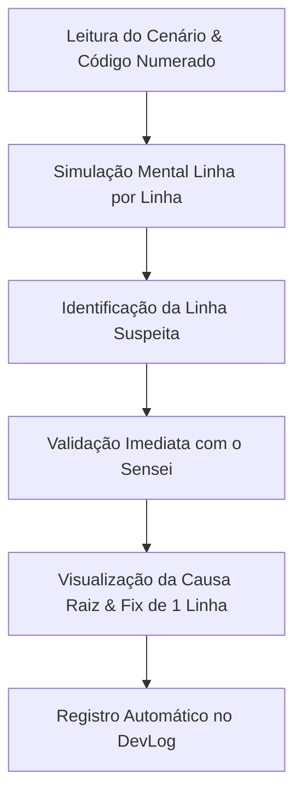

# 🔍 Guia do Caça-Bugs (Code Review Reverso)

Na vida profissional de desenvolvimento, **você passa 80% do tempo lendo código alheio e apenas 20% escrevendo código novo**.

O modo **Caça-Bugs** (`python main.py hunt`) inverte a dinâmica tradicional: em vez de você digitar uma função a partir do zero, o Sensei te apresenta trechos de código com **1 defeito sutil de runtime** escondido. Sua missão é ler com olhar clínico, identificar a linha defeituosa e formular a hipótese do erro.

---

## 🎯 Por que o Code Review Reverso é tão poderoso?

1. **Combate a Ilusão de Autoria**: Quando você escreve seu próprio código, você tem um viés de confirmação e "lê o que pretendia ter escrito", ignorando seus próprios bugs.
2. **Treina Leitura Linha por Linha**: Programadores experientes não olham para o código como uma foto estática; eles leem cada instrução simulando as variáveis na memória RAM mental.
3. **Reconhecimento Rápido de Padrões Perigosos**:
   - Loops com `<=` no length (Off-by-one).
   - `.sort()` sem comparador em listas de números.
   - Retorno esquecido dentro de `.map({ ... })`.
   - `.forEach()` disparando funções assíncronas que ninguém espera.
   - Shallow copy mutando objetos aninhados.



---

## 🚀 Como Praticar

No terminal:
```bash
python main.py hunt
```

### O Fluxo no Terminal:
1. O Sensei descreve o comportamento esperado vs o sintoma real (ex: *"A função retorna NaN em vez da soma"*).
2. O código é exibido numerado linha por linha:
   ```text
    1 | function somarValores(numeros: number[]): number {
    2 |     let total = 0;
    3 |     for (let i = 0; i <= numeros.length; i++) {
    4 |         total += numeros[i];
    5 |     }
    6 |     return total;
    7 | }
   ```
3. Você digita a linha com defeito (ex: `3`).
4. O Sensei avalia:
   - Se acertou: ganha o ponto e a explicação detalhada do porquê.
   - Se errou: revela a divergência de modelo mental para você ajustar sua percepção.
5. Mostra a **correção de 1 linha** recomendada.
6. Permite salvar a análise diretamente no seu [[Guia-do-DevLog|DevLog]].

---

## 🔗 Navegação Relacionada
- Aprenda como estudar ativamente em [[Como-Estudar-Sem-IA]].
- Registre suas lições em [[Guia-do-DevLog]].
- Treine previsão mental em [[Arquitetura-Code-Sensei#3-sensei/tracer.py (Compilador Mental)]].
- Voltar ao início: [[INDEX]].
