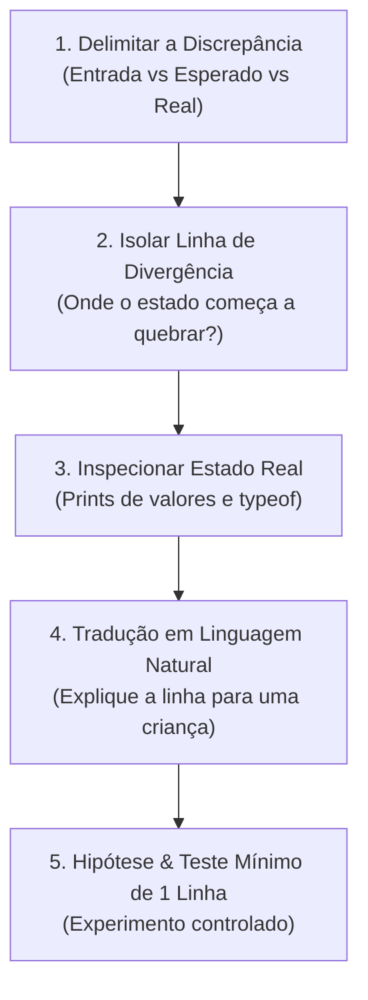

# 🦆 Metodologia do Pato Socrático (Depuração Ativa)

O **Pato Socrático** é o seu antídoto contra o vício de colar stack traces em chats de IA. 

O ato de forçar seu cérebro a articular o problema em voz alta ou por escrito ativa o córtex pré-frontal, permitindo enxergar divergências que o olho passivo não nota.

---

## As 5 Etapas da Investigação



### Etapa 1: Delimitar a Discrepância
- Nunca tente consertar sem saber exatamente a distância entre o esperado e o observado.
- *Qual é a entrada exata?* (Ex: `somarSeguro("10", null)`).
- *Qual foi a saída real?* (Ex: retornou `10` em vez de disparar `TypeError`).
- *Qual era a saída esperada?* (Ex: `TypeError("Argumento invalido")`).

### Etapa 2: Isolar a Linha de Divergência
Um programa é uma linha do tempo. Em que instrução exata a realidade divergiu da teoria?
- Coloque um print imediatamente **antes** do ponto suspeito.
- A linha de execução chegou até lá? Se não chegou, o bug está antes.

### Etapa 3: Inspecionar o Estado Real (Fatos vs Suposições)
> [!warning] O Grande Erro
> 90% dos programadores assumem que uma variável vale `X` quando ela na verdade vale `undefined` ou `"0"` (string).
- Imprima o valor e o tipo:
  ```javascript
  console.log("DEBUG:", typeof minhaVariavel, minhaVariavel);
  ```

### Etapa 4: Tradução em Linguagem Natural
- Explique em voz alta ou escreva em uma frase simples o que aquela instrução faz, sem jargões.
- Exemplo: *"Estou pegando o tamanho do array e subtraindo 1 porque o último índice é sempre length - 1."*
- Se a explicação parece estranha ao ser lida, a lógica no código está errada.

### Etapa 5: Hipótese & Experimento Mínimo
- Formule uma causa: *"Acho que o laço não entra na última volta porque usei `<` em vez de `<=`."*
- Altere apenas **UMA** coisa e rode o teste novamente.
- Nunca mude 5 linhas ao mesmo tempo sem saber qual fez efeito.

---

## Como iniciar no terminal

Basta digitar:
```bash
python main.py duck
```
O Sensei conduzirá a entrevista com você passo a passo e, ao final, permitirá salvar toda a análise diretamente no seu [[Guia-do-DevLog|DevLog]].

---

## 🔗 Navegação
- Registre o que aprendeu com [[Guia-do-DevLog]].
- Conheça os desafios em [[Mapa-de-Niveis]].
- Voltar ao início: [[INDEX]].
