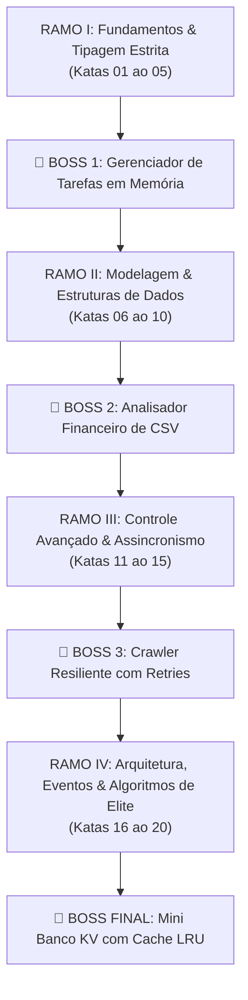

# 🌳 Sistema de Faixas RPG & Árvore de Habilidades

> [!important] Filosofia da Maestria Sem Atalhos
> Em artes marciais tradicionais, ninguém ganha uma faixa preta assistindo a vídeos ou pedindo para um mestre lutar em seu lugar. A faixa é o reflexo da **memória muscular**, do **suor** e das **centenas de repetições deliberadas**. Na programação de verdade, o código gerado por IA é a ilusão de lutar bem; resolver katas e projetar arquiteturas com a própria cabeça é a maestria real.

O **Code Sensei** utiliza um sistema de progressão inspirado no Judô/Karatê e em RPGs clássicos, operando **100% offline**, calculando sua consistência através do histórico local de commits do Git e registros do DevLog.

---

## 🥋 Sistema de Graduação por Faixas

| Faixa | Título | Requisitos | Filosofia / Capacidade Adquirida |
| :--- | :--- | :--- | :--- |
| 🥋 **Branca** | *Iniciante* | 0 a 4 Katas | O despertar da Notional Machine. Dominando coerção, controle de fluxo e laços manuais. |
| 🥋 **Amarela** | *Praticante* | 5 Katas + Boss 1 | Fundamentos e closures consolidados. Capaz de criar mini-aplicações em memória. |
| 🥋 **Laranja** | *Ascendente* | 10 Katas + Boss 2 | Modelagem de dados, desestruturação segura e tipagem estrita com TypeScript afiada. |
| 🥋 **Verde** | *Arquiteto* | 15 Katas + Boss 3 | Mestre do assincronismo real, Promises encadeadas, Generics e resiliência a falhas de rede. |
| 🥋 **Marrom** | *Graduado* | 20 Katas + Boss 3 | Todos os 20 katas dominados. Concorrência controlada, Streams/I/O e Cache LRU em O(1). |
| 🥋 **Preta** | *Code Sensei* | 20 Katas + 4 Bosses + 3 DevLogs | Maestria completa: autonomia técnica absoluta para criar qualquer software sem muletas de IA. |

---

## 🌿 Os 4 Ramos da Árvore de Conhecimento (Skill Tree)



### 1. Ramo I: Fundamentos & Lógica Estrita
- `01_primitives_coercion`: Valores falsy e coerção implícita.
- `02_conditionals_branching`: Desvios condicionais e tabelas de decisão.
- `03_loops_accumulators`: Laços de repetição e acumuladores manuais sem `.reduce()`.
- `04_array_basics`: Varredura de extremos e loteamento de vetores (chunking).
- `05_functions_closures`: Encapsulamento de estado léxico e memoização.
- **Marco:** [[Boss-Fights-Guia#Boss-1]]: CRUD em memória com pesquisas e filtros.

### 2. Ramo II: Modelagem & Estruturas de Dados
- `06_objects_destructuring`: Projeção de dados (Pick) e merge imutável.
- `07_ts_basic_interfaces`: Contratos fortes de tipos no TypeScript.
- `08_ts_unions_narrowing`: Unions discriminadas e type guards.
- `09_array_methods_map_filter`: Transformações puras em coleções.
- `10_array_methods_reduce`: Agrupamentos e histogramas de frequência.
- **Marco:** [[Boss-Fights-Guia#Boss-2]]: Pipeline analítico de balanços financeiros.

### 3. Ramo III: Controle Avançado & Assincronismo
- `11_sets_and_maps`: Interseções rápidas e índices em $O(1)$.
- `12_error_handling_custom`: Hierarquia de classes de erro e parsing resiliente.
- `13_ts_generics`: Estruturas reutilizáveis tipadas (Fila FIFO genérica).
- `14_async_promises_basics`: Envelopamento de callbacks e corridas de timeout (`Promise.race`).
- `15_async_await_flow`: Controle sequencial com retentativas com backoff.
- **Marco:** [[Boss-Fights-Guia#Boss-3]]: Crawler concorrente com retry exponencial.

### 4. Ramo IV: Arquitetura, Eventos & Algoritmos de Elite
- `16_async_concurrency_limit`: Pool semafórico de workers assíncronos.
- `17_node_path_fs`: Manipulação atômica de arquivos e diretórios em disco.
- `18_node_events_streams`: Arquitetura desacoplada orientada a eventos.
- `19_mental_trace_real_bugs`: Debugging reverso de armadilhas clássicas da linguagem.
- `20_lru_cache_algorithm`: Implementação do algoritmo de Cache LRU em $O(1)$.
- **Marco:** [[Boss-Fights-Guia#Boss-4]]: Banco de dados Chave-Valor em disco com cache e pub/sub.

---

## 🔥 Cálculo de Streaks Git 100% Offline

A maioria dos apps de estudo usa servidores na nuvem que vendem seus dados e exigem login. O Sensei calcula seu hábito de estudo lendo a história do seu próprio repositório Git local:
- Executa: `git log --format="%cd" --date=short`
- Mapeia os dias em que você realizou commits ou registrou lições no `devlog/`.
- Se você codificar hoje ou ontem, seu **fogo de consistência (🔥)** se mantém aceso.
- O menor deslize de mais de 48 horas zera o streak atual, preservando o **Recorde Histórico**.

---

## ⚡ Comandos no Terminal

```bash
# Visualizar a Árvore de Habilidades completa e status dos 4 ramos:
python main.py tree

# Ver seu resumo de RPG, Faixa, XP e Streak:
python main.py stats
```

---

## 🔗 Links Relacionados
- [[INDEX]]: Hub Central do Cérebro
- [[Mapa-de-Niveis]]: Detalhamento conceitual dos 20 níveis
- [[Boss-Fights-Guia]]: Guias de arquitetura dos 4 projetos marcos
- [[Guia-do-DevLog]]: Metacognição e registro de aprendizados
